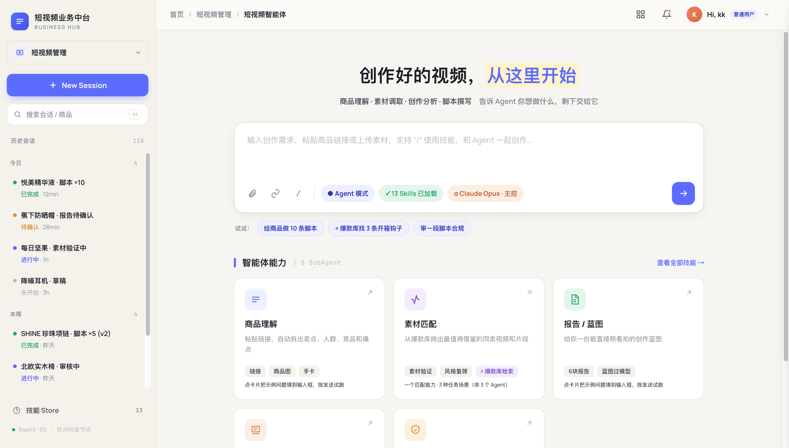
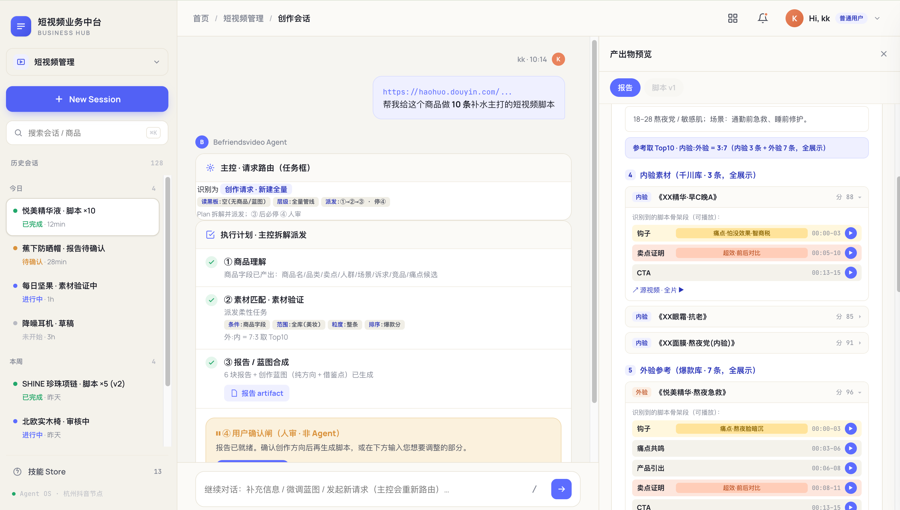

# Befriendsvideo — Multi-Agent AI Platform for E-commerce Short-Video Script Creation

**English | [中文](./README.zh-CN.md)**

**Live demo:** https://danyangkk.github.io/befriendsvideo/

An AI-native multi-agent platform that translates the expertise of top short-video creators into system architecture — input a product link + an idea, get a creative-elements report and ready-to-shoot scripts with storyboards.

## Architecture at a glance
- **1 Orchestrator (CLAUDE.md) + 5 capability SubAgents + 1 offline collection agent**, built on the open-source Hermes Agent framework
- **Session blackboard + 6 invalidation contracts**: state-driven routing ("what changed → what's stale → recompute from the earliest stale step, reuse the rest")
- **13 standardized SKILLs** with registry governance and a self-improving skill-candidate loop
- **Viral-asset warehouse**: dual sources × Top-100 per category, explainable virality scoring, 3-stage retrieval (category filter → vector recall → LLM re-ranking)
- **5 system loops**: creation / revision / data ingestion / skill consolidation / effectiveness measurement
- **4 process metrics** designed ahead of launch (first-pass confirmation rate, tweak rounds, first-pass audit rate, script export rate)

## Screenshots

**Home — agent entry & capability overview**

**Creation session — multi-step orchestration with report preview**

## About this demo
This is a **high-fidelity interactive prototype** used for interaction validation and engineering alignment. **All data is mocked; there is no backend.** The production frontend would be rebuilt from this prototype as the visual spec.

Try it: submit the sample product link on the home page → walk through the creation flow → tweak the hook at the confirmation gate → confirm to generate scripts → switch role (top-right) to Admin to view the metrics dashboard and skill registry.
